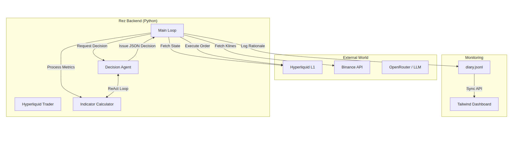

# Overview

Rez is designed as an asynchronous, event-driven trading system. It operates in a continuous loop, orchestrating data between exchange APIs, local computational engines, and remote Large Language Models.

## High-Level Architecture

The following diagram illustrates the primary components and the flow of data during a single trading cycle.

<figure><figcaption></figcaption></figure>

## Core Component Responsibilities

#### Main Control Loop (`src/main.py`)

The "heartbeat" of the system. It manages the execution timing (intervals), error handling, and orchestrates the transition between state synchronization, decision making, and execution.

#### Decision Agent (`src/agent/`)

The reasoning engine. It takes the structured market context and uses LLMs to generate trade theses. It specifically manages the multi-turn tool-calling loop to ensure high-confluence decisions.

#### Indicator Engine (`src/indicators/`)

The computational layer. It fetches raw candle data from Binance and uses `pandas-ta` to calculate technical indicators locally. This ensures that the agent always works with mathematically accurate, non-lagging data.

#### Trading Engine (`src/trading/`)

The interface to the Hyperliquid exchange. It handles authentication, signing of transactions, and manages the placement of both market orders and secondary trigger orders (Take-Profit/Stop-Loss).

#### Monitoring Dashboard (`frontend/`)

A real-time visualization layer that consumes the backend's `diary.jsonl` to display PnL tracker, active positions, and the agent's internal reasoning logs.

## The Execution Cycle

A typical cycle follows this sequence:

1. **Sync**: Fetch account balance and current positions from Hyperliquid.
2. **Ingest**: Pull latest OHLCV candles for tracked assets.
3. **Calculate**: Generate EMA, RSI, and Volatility metrics locally.
4. **Reason**: Dispatch metrics to the LLM; handle any recursive tool calls.
5. **Execute**: Place market orders based on the decision.
6. **Secure**: Immediately attach TP/SL trigger orders to the newly opened positions.

## Technology Stack

* **Runtime**: Python 3.12+ (Backend), Node.js (Frontend)
* **Frameworks**: `aiohttp` (API), Next.js 15 (Dashboard), Tailwind CSS 4
* **Libraries**: `hyperliquid-python-sdk`, `pandas-ta`, `pydantic`
* **AI**: OpenRouter (Unified Interface for GPT-4, Claude, etc.)

## Directory Structure

```
rez-2.0/
├── src/                          # Python backend
│   ├── main.py                   # Entry point, trading loop, API server
│   ├── config_loader.py          # Environment configuration
│   ├── agent/                    # LLM-based decision logic
│   ├── indicators/               # Local technical analysis
│   └── trading/                  # Exchange integration
├── frontend/                     # Next.js dashboard
├── openspec/                     # Spec-driven development files
└── docs/                         # Documentation (You are here)
```
